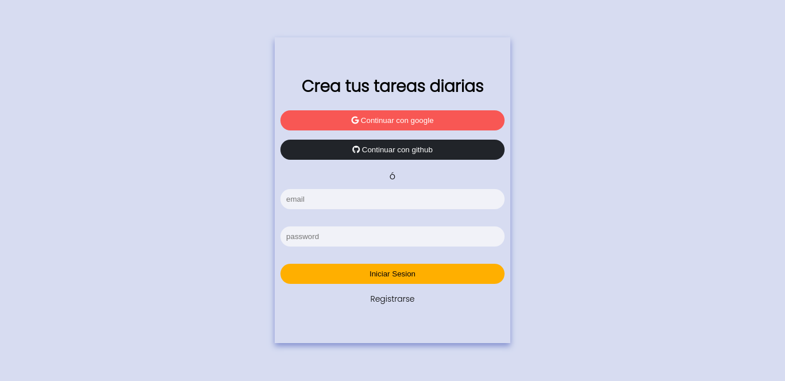
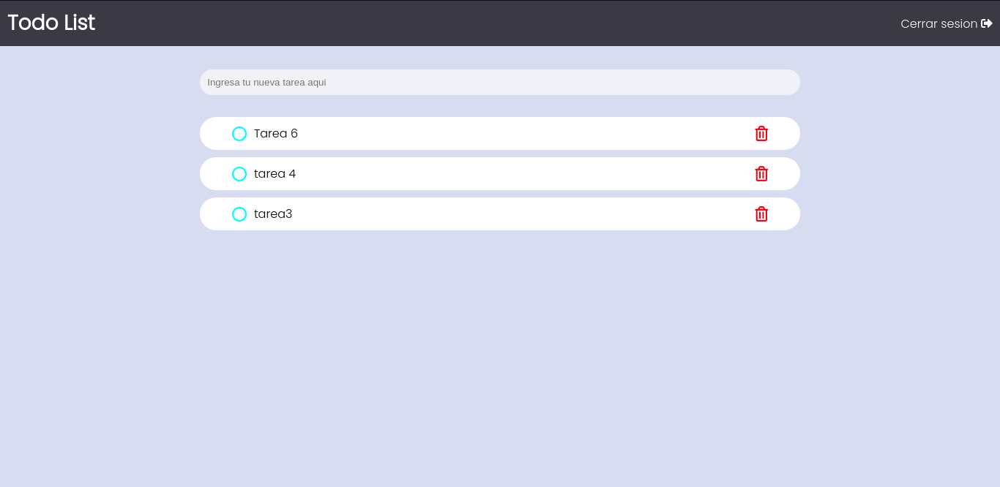

# Getting Started

Add your token in firebaseConf.js

In firestore add the rule

```
rules_version = '2';
service cloud.firestore {
  match /databases/{database}/documents {
    match /{document=**} {
      allow read, write: if request.auth.uid != null;
    }
  }
}
```

## Captures



